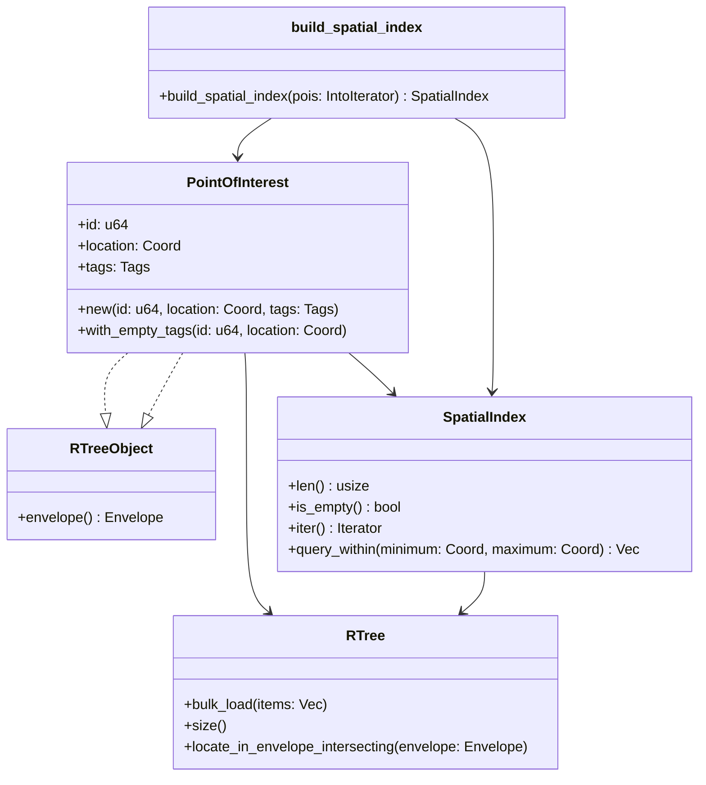
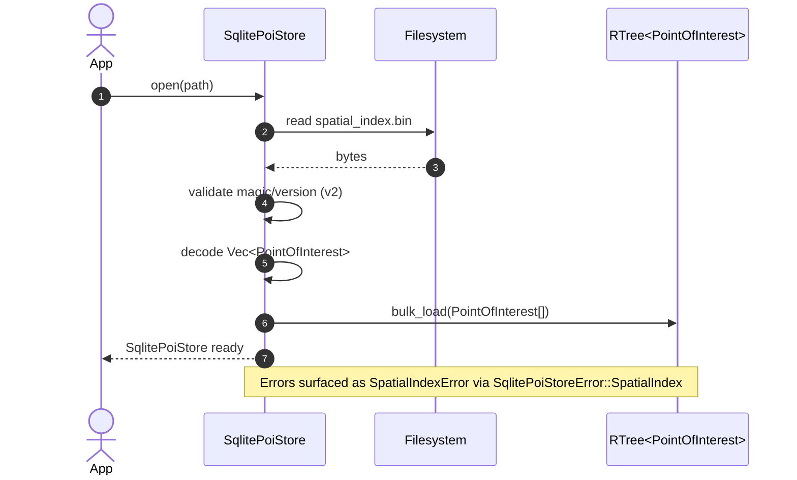
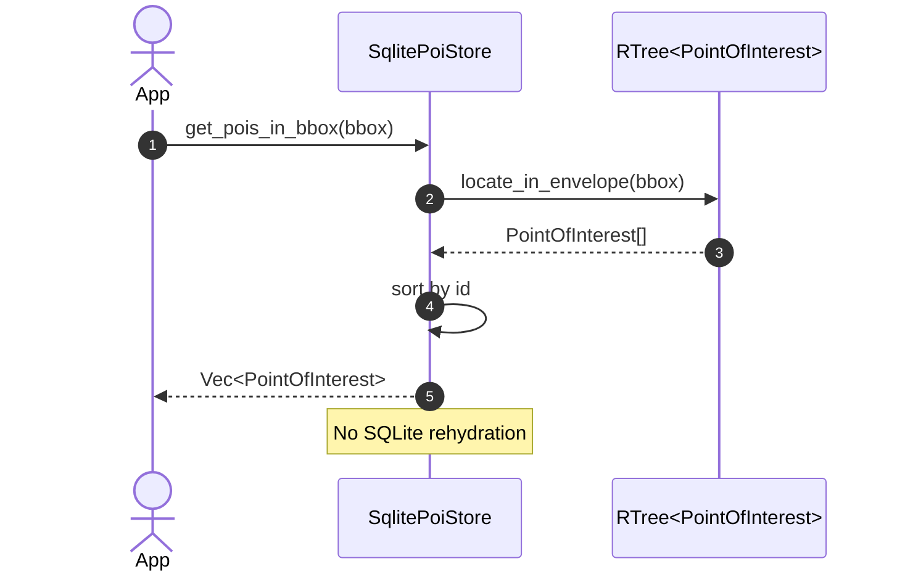

# Introduction

The Wildside recommendation engine represents a sophisticated system designed
to generate personalized, interesting walking tours by harmonizing geospatial
data with rich semantic information. The challenge lies in translating this
ambitious conceptual design into a robust, performant, and maintainable
software application. This report provides an exhaustive, expert-level analysis
of Rust libraries, architectural patterns, and implementation strategies to
build the Wildside engine, moving from the abstract problem statement to a
concrete engineering blueprint.

The selection of the Rust programming language for this endeavor is
well-founded. Rust's emphasis on performance, memory safety, and concurrency
makes it an ideal candidate for a system that is both data-intensive and
computationally demanding.1 The core tasks of parsing massive binary data
files, executing complex scoring algorithms, and solving NP-hard optimization
problems all align with the language's strengths.

This report is structured to follow the logical data flow of the Wildside
engine. It begins with the foundational layer of data ingestion, evaluating
options for processing OpenStreetMap and Wikidata. It then proceeds to the
implementation of the POI scoring and personalization algorithms. The
subsequent sections have been significantly revised to reflect a library-first
architecture, detailing a multi-crate structure, a stable API contract, a
rigorous testing discipline, and a clear implementation roadmap. This ensures
that every technical decision is justified, every trade-off is examined, and
the final proposed architecture is powerful, pragmatic, and built for long-term
maintainability.

## Core domain model

The engine relies on a small set of shared data structures housed in the
`wildside-core` crate. Keeping these types minimal reduces coupling while
providing a stable vocabulary across crates.

- `PointOfInterest` stores a unique identifier, a `geo::Coord`, and a map of
  tags. Tags remain a `HashMap<String, String>` to mirror the free-form
  key/value pairs common in OpenStreetMap. Convenience constructors provide
  explicit creation paths with or without tags. The struct now implements
  `rstar::RTreeObject`, allowing POIs to be inserted directly into R\*-trees
  without additional wrappers.
- `Theme` is an enum describing broad categories like history, art, and food.
  Using an enum rather than free-form strings prevents runtime typos.
- `InterestProfile` represents thematic preferences as a `HashMap<Theme, f32>`
  of weights. Builder-style methods (`with_weight` and `set_weight`) support
  ergonomic construction and mutation.
- `Route` contains the ordered list of `PointOfInterest` values selected for a
  tour and the overall `Duration` required to visit them. `Route::new` and
  `Route::empty` offer clear constructors.
<!-- markdownlint-disable-next-line MD013 -->
- `PoiStore` abstracts read-only POI access. The
  <!-- markdownlint-disable-next-line MD013 -->
  `get_pois_in_bbox(&self, bbox: &geo::Rect<f64>) -> Box<dyn Iterator<Item = PointOfInterest> + Send + '_>`
   method returns all POIs inside an axis-aligned bounding box (WGS84;
  `x = longitude`, `y = latitude`). The full semantics are documented in
  [`wildside_core::store::PoiStore`](../../wildside-core/src/store.rs);
  indexing strategy is left to implementers.
- `SqlitePoiStore` is the first production-grade implementation of that
  interface. It expects two artefacts produced by the offline ETL pipeline:
  `pois.db` (an SQLite database whose `pois` table stores POI ids, coordinates,
  and JSON-encoded tags) and `pois.rstar` (a binary R\*-tree serialization).
  The binary artefact uses a fixed `WSPI` magic number, a little-endian `u16`
  version (currently `2`), followed by a `bincode` payload of
  [`PointOfInterest`](../../wildside-core/src/poi.rs) structs. Version 2 stores
  the full POI records (id, `geo::Coord`, and tag map) directly in the R\*-tree
  so lookups can avoid secondary hash-map probes. During start-up the store
  reads these entries, validates them against SQLite in batches, and bulk-loads
  an in-memory `RTree<PointOfInterest>`. Bounding-box queries clone matching
  entries from the tree, avoiding additional database round-trips.
<!-- markdownlint-disable-next-line MD013 -->
- `TravelTimeProvider` produces an `n×n` matrix of `Duration` values for a
  slice of POIs via
  <!-- markdownlint-disable-next-line MD013 -->
  `get_travel_time_matrix(&self, pois: &[PointOfInterest]) -> Result<TravelTimeMatrix, TravelTimeError>`.
   The method returns an error if called with an empty slice, ensuring callers
  validate inputs before requesting travel times.

- `Scorer` converts a `PointOfInterest` and an `InterestProfile` into a `f32`
  relevance score. Implementations must be `Send + Sync` so scoring can occur
  across threads. The method is deterministic and infallible; implementers
  return `0.0` when no signals are present. This keeps scoring simple and
  composable for different weighting strategies.

  Implementations MUST return finite, non-negative values. Scores SHOULD be
  normalised to the `[0.0, 1.0]` range unless explicitly documented otherwise,
  allowing callers to combine signals with predictable bounds. Implementations
  MUST produce identical scores for identical inputs, guaranteeing
  deterministic behaviour.

- Test utilities such as an in-memory `PoiStore`, a unit travel-time provider,
  and a `TagScorer` compile automatically in tests and are gated behind a
  `test-support` feature for consumers, preventing accidental production
  dependencies.

## Spatial indexing

Spatial queries rely on the `SpatialIndex` newtype, which wraps an
`rstar::RTree<PointOfInterest>` built through the `build_spatial_index` helper.
`build_spatial_index` consumes any iterator of POIs and uses `RTree::bulk_load`
to balance the tree in a single pass without cloning owned data. The index
exposes read-only helpers for iteration, bounding-box queries, and length
checks while keeping `rstar` types out of the public API. Reusing the GeoRust
`Coord` type keeps geometric semantics consistent across ingestion, storage,
and querying components.

The following class diagram describes the relationships between
`PointOfInterest`, `SpatialIndex`, the underlying R-tree, and the
`build_spatial_index` helper.

These definitions form the backbone of the recommendation engine; higher level
components such as scorers and solvers operate exclusively on these types.

At runtime the `SqlitePoiStore` provides the fast-path for spatial lookups. The
R\*-tree owns full `PointOfInterest` values, so query responses can be produced
without re-querying SQLite. Start-up still validates every referenced id in
manageable batches, hydrating rows only to surface missing entries or malformed
tag payloads. Once validation succeeds the database connection is released, and
bounding-box queries clone matching POIs directly from the tree, guaranteeing a
stable response order.

The following sequence diagram shows how the application queries the SQLite POI
store which uses an R-tree to locate points within a bounding box.

