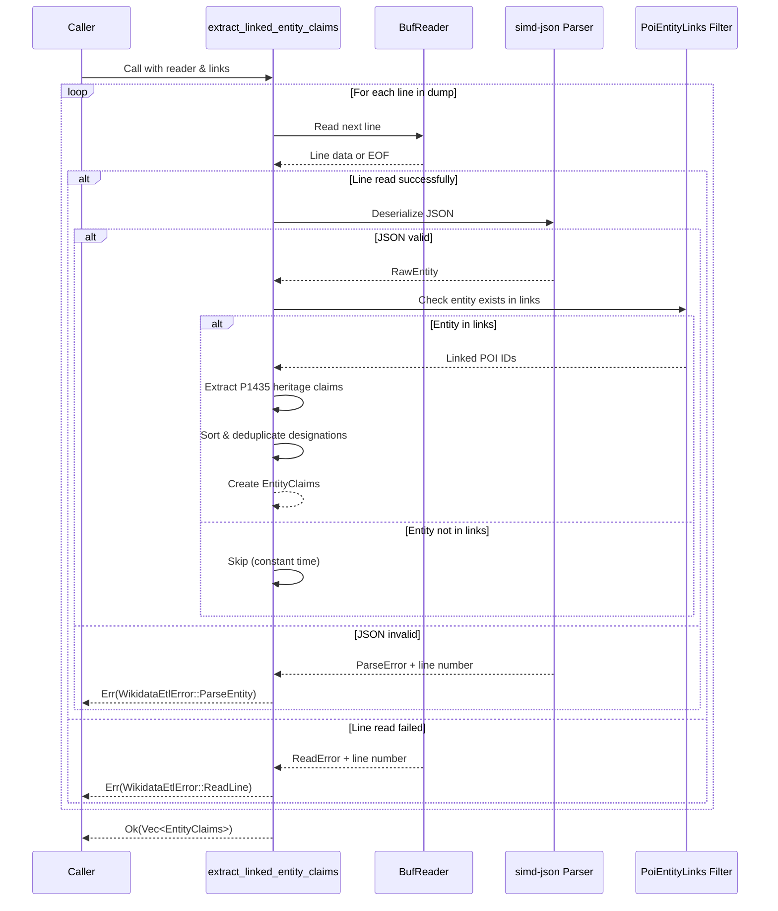

# Section 1: The Data Foundation - Ingesting and Integrating Open Data

The intelligence of the Wildside engine is predicated on the quality and
accessibility of its data. This section details the critical first stage of the
system: building a robust, efficient, and scalable data ingestion pipeline for
the OpenStreetMap (OSM) and Wikidata datasets. The architectural and library
choices made here will fundamentally impact the performance, operational cost,
and development complexity of the entire application. The goal is to transform
raw, community-driven data into a set of structured, read-only artefacts that
can be efficiently queried by the core engine.

## 1.1. Processing Geospatial Structure: A Comparative Analysis of OpenStreetMap PBF Parsers

The problem statement correctly identifies that OSM's flexible, schema-less
tagging system and the sheer volume of data contained in Protocolbuffer Binary
Format (PBF) files present a significant data processing challenge. The first
and most crucial step is to select a high-performance, reliable, and
permissively licensed parser to extract nodes, ways, and relations from these
files.

Two prominent candidates emerge from the Rust ecosystem: `osmpbf` and
`osmpbfreader`. While both are capable, they differ significantly in licensing
and features, making the choice between them a critical one.

Candidate 1: osmpbf

The osmpbf crate is a modern library designed with performance as a primary
goal.[^2] It offers lazy-decoding and, most importantly, built-in support for
parallelism. The PBF format is structured as a sequence of independent "blobs,"
a design that `osmpbf` leverages to process these blobs in parallel across
multiple CPU cores. Its `par_map_reduce` method provides a high-level,
idiomatic Rust API for this purpose, which is an essential feature for
efficiently processing the country- or continent-sized PBF files that a service
like Wildside would need to ingest.[^2] From a legal standpoint, `osmpbf` is
dual-licensed under the Apache-2.0 and MIT licences, which are standard,
permissive licences suitable for commercial software development.[^2]

Candidate 2: osmpbfreader

The osmpbfreader crate is another popular and effective library for this task,
with a track record of strong performance on large datasets.[^3] However, its
licensing presents a challenge. The crate is licensed under the "Do What The
Fuck You Want To Public Licence, Version 2" (WTFPLv2).[^3] While extremely
permissive in spirit, its unconventional wording can be a point of friction for
corporate legal review.

The user's requirement for a "permissive licence" is a critical non-functional
requirement. Fortunately, the legally clearer choice is also the technically
superior one for this use case. The explicit, high-level parallel processing
API in `osmpbf` directly addresses the need for efficiency in the offline ETL
process.

### Table 1: Comparative Analysis of OSM PBF Parser Crates

| Crate Name   | Primary Licence  | Key Technical Features                                                                                 | Maintenance Status        | Suitability for Wildside                                                                                                                                                                             |
| ------------ | ---------------- | ------------------------------------------------------------------------------------------------------ | ------------------------- | ---------------------------------------------------------------------------------------------------------------------------------------------------------------------------------------------------- |
| osmpbf       | MIT / Apache-2.0 | High-performance parallel processing (par_map_reduce), lazy decoding, clear API for PBF hierarchy.[^2] | Updated 5 months ago.[^4] | Highly Recommended. The combination of industry-standard permissive licensing and explicit support for parallelism makes it the ideal choice for a robust, commercial-grade data ingestion pipeline. |
| osmpbfreader | WTFPLv2          | Proven performance on large files, support for resolving object dependencies.                          | Updated 2 months ago.     | Not Recommended. The WTFPLv2 licence introduces unnecessary legal risk for a commercial project. While technically capable, the licensing issue is a critical blocker.                               |

**Final Recommendation:** The `osmpbf` crate is the unequivocally recommended
library. Its combination of industry-standard permissive licensing and
high-performance parallel processing features makes it the ideal and most
responsible foundation for the Wildside OSM data ingestion pipeline.

### Implemented ingestion summary API

The initial ingestion surface now lives in the `wildside-data` crate. The
`ingest_osm_pbf` function wraps `osmpbf::ElementReader::par_map_reduce` to
count nodes, ways, and relations while computing a `geo::Rect` bounding box for
all node coordinates. The summary aggregates results from each blob in
parallel, providing deterministic totals that are safe to merge across threads.
The ingestion surface now exposes an `OsmIngestReport` layered atop the
summary. It emits `PointOfInterest` records: nodes tagged with `historic` or
`tourism` become POIs immediately, while tagged ways defer until their node
geometry is known. The pass keeps a lightweight coordinate index for referenced
nodes and encodes element identifiers into the `PointOfInterest::id` namespace
by reserving the top two bits for the element kind. Way geometry anchors to the
first resolved node, trading perfect accuracy for deterministic behaviour until
richer geometric primitives arrive. Ways whose referenced nodes are missing or
invalid are skipped to prevent ghost POIs.

A parallel scan records unresolved way nodes before a sequential follow-up
hydrates only the coordinates still missing, keeping memory usage bounded by
the relevant geometry. Identifiers left unresolved after both passes emit
warnings, so operators can investigate fixture gaps early.

## 1.2. Semantic Enrichment: Strategies for Interfacing with Wikidata

The `wikidata=*` tag is the "critical conduit" that transforms raw OSM data
into rich, queryable knowledge. The most robust architecture for accessing this
information is to create a local, high-performance copy of the necessary
Wikidata information via an offline ETL (Extract, Transform, Load) pipeline. A
detailed technical design for this ETL lives in
`docs/wikidata-etl-pipeline-technical-design.md`.

This approach involves periodically downloading the complete Wikidata JSON dump
and loading it into a local, indexed database. A fast, parallel parser is
essential. The `wikidata-rust` crate is a purpose-built tool for this task.[^5]
For storage, the `wd2sql` tool provides an excellent template: it uses
`simd-json` for high-speed parsing and loads the data into a queryable SQLite
database. This strategy can be replicated or adapted, potentially using a
higher-performance key-value store like RocksDB (for which Rust has mature
bindings such as `librocksdb-sys`) to create custom indices tailored
specifically to the properties required for POI scoring.

The primary advantage of this approach is extremely low query latency, as all
lookups happen against a local database. It enables complex, pre-calculated
analytics (such as the global popularity score) and makes the service immune to
public endpoint outages. The nature of the Wildside scoring algorithm, which
requires checking multiple properties for thousands of candidate POIs per
request, makes this offline approach the only viable long-term solution.

### 1.2.1. Initial dump acquisition implementation

The first increment of the Wikidata ETL focuses on reliably acquiring and
auditing the upstream dump artefact. The `wildside-data` crate now exposes a
`wikidata::dump` module that encapsulates three responsibilities:

- **HTTP transport:** `HttpDumpSource` wraps the asynchronous `reqwest`
  client, issues requests for the Tokio runtime, and always sends a descriptive
  `User-Agent` string. Responses stream through `tokio-util`'s `SyncIoBridge`,
  letting the downloader parse `dumpstatus.json` and copy the archive without
  materializing the payload in memory while still surfacing network faults as
  structured `TransportError` values.
- **Manifest parsing:** `resolve_latest_descriptor` downloads
  `dumpstatus.json`, decodes it with `simd-json`, and walks the manifest to
  locate the most recent `*-all.json.bz2` artefact. The parser ignores
  unrelated jobs and tolerates missing optional fields, surfacing
  `WikidataDumpError::MissingDump` when no suitable entry is found.
- **Download logging:** `DownloadLog` stores a durable audit trail in
  SQLite via `rusqlite`. The crate is compiled with the `bundled` feature, so
  CI and developer workstations link against the same SQLite release.
  Initialization seeds uniqueness and timestamp indexes. It records the
  selected file name, URL, checksums, and byte counts. This metadata primes
  future reconciliation jobs that will import claims into `pois.db`.

The binary entry point (`cargo run -p wildside-data --bin wikidata_etl`)
connects those primitives to an operator-facing CLI backed by `clap`. Users
select an output directory, optionally override the file name, and can opt in
to logging by passing `--metadata <path>`. Standardized flag handling now
covers help/version output and validation, and the tool refuses to overwrite
existing dumps unless `--overwrite` is supplied. Successful runs emit a
succinct summary, keeping the command idempotent and easy to schedule whilst
the downstream parsing stages are implemented.

### 1.2.2. Linked entity extraction implementation

The second increment introduces a streaming parser that connects the Wikidata
dump to the POIs discovered during OSM ingestion. The `PoiEntityLinks`
structure scans the ingested POIs, normalizes `wikidata=*` tag values (handling
common variants such as full URLs), and records the mapping from Wikidata
entity identifiers to OSM ids. The parser accepts any `Read` implementation and
wraps it in a `BufReader` so the huge JSON dump is never materialized in
memory. Each line is trimmed, commas that separate JSON entries are removed,
and the payload is deserialized via `simd-json` into a lightweight
representation containing just the entity id and claims.

Only entities referenced by the `PoiEntityLinks` set are processed further. For
those entities, the parser extracts `P1435` heritage designation claims by
inspecting the `mainsnak` data, filtering for `value` snaks, and collecting the
target entity ids. Both the linked POI ids and the designation ids are sorted
and deduplicated to keep the downstream SQLite schema deterministic. Errors are
surfaced with line numbers, so operators can diagnose malformed dump entries
without re-running the entire pipeline, while unrelated entities are skipped in
constant time.

The following sequence diagram illustrates the line-by-line processing flow,
including entity filtering, claim extraction, and error handling with
line-numbered reporting.

### 1.2.3. SQLite schema for Wikidata claims

The extracted claims are stored in the shared `pois.db` database via the
`wildside_data::wikidata::store` module. Schema initialization is handled by
the `initialise_schema` function, which enables foreign keys and creates a
compact set of normalized tables:

- `wikidata_entities` contains every entity identifier appearing in the dump.
- `poi_wikidata_links` maps POI ids to their linked Wikidata entities and
  enforces referential integrity against the existing `pois` table.
- `wikidata_entity_claims` stores statement triples for each entity, keyed by
  `(entity_id, property_id, value_entity_id)`. The first use case captures
  `P1435` heritage designations, but the schema supports future properties.

Indexes on `poi_wikidata_links(entity_id, poi_id)` and
`wikidata_entity_claims(property_id, value_entity_id, entity_id)` keep POI and
property lookups fast. A view named `poi_wikidata_claims` joins both tables, so
the scoring pipeline can resolve a POI's claims without handwritten joins. A
`wikidata_schema_version` table records the schema version (`1` initially) so
future migrations can detect outdated installations. Claim persistence performs
idempotent inserts and verifies that every referenced POI exists before
linking; missing POIs raise an explicit `MissingPoi` error rather than failing
deep in SQLite.

### Table 2: Comparative Analysis of Wikidata Interaction Strategies

| Approach                | Key Crates                         | Data Freshness                  | Request Latency              | Infrastructure Complexity     | Scalability for Wildside's Scoring                                                                                           |
| ----------------------- | ---------------------------------- | ------------------------------- | ---------------------------- | ----------------------------- | ---------------------------------------------------------------------------------------------------------------------------- |
| Live SPARQL Queries     | tokio, sparql-client[^6]           | Real-time                       | High (100s of ms to seconds) | Low (stateless)               | Very Poor. Infeasible to run thousands of queries per user request. Will be rate-limited and result in extreme latency.      |
| Offline Dump Processing | wikidata-rust, simd-json, rusqlite | Stale (updated on ETL schedule) | Very Low (sub-millisecond)   | High (ETL pipeline, database) | Excellent. Enables millions of fast, local lookups per second, making the personalization algorithm performant and scalable. |

**Final Recommendation:** Implement an **offline data processing pipeline
(Approach B)**. For the initial implementation, a `wd2sql`-inspired approach
using a local SQLite database managed via the `rusqlite` crate offers the best
balance. The `wikidata` crate will be invaluable for defining the Rust data
structures that model Wikidata entities and claims.

## 1.3. Foundational Geospatial Primitives and Spatial Indexing

Once the raw data is parsed from OSM, it must be represented in structured
geometric types and indexed for efficient spatial querying. The Rust community
has consolidated its geospatial efforts into the `GeoRust` collective, which
provides a suite of interoperable and well-maintained crates.[^8]

Core Data Types with geo

The geo crate is the cornerstone of this ecosystem, providing the fundamental
building blocks for geospatial work in Rust. It defines primitive types such as
Point, LineString, Polygon, and Coord.[^9] These types will serve as the
canonical representation of POI locations and walking paths throughout the
Wildside application.

High-Performance Spatial Indexing with rstar

To efficiently implement the "Candidate Selection" step, a spatial index is
non-negotiable. The R\*-tree is the ideal data structure for this task, and the
rstar crate is the premier implementation in the Rust ecosystem.[^10] It is
designed to work seamlessly with the types from the `geo` crate. The practical
implementation will be to build an `rstar::RTree` during the offline data
ingestion phase and load it into memory. When a user request is received, a
call to `rstar`'s rectangle query method will retrieve all candidate POIs
within a bounding box in milliseconds.[^12]

**Recommendation:** Fully adopt the `GeoRust` **ecosystem**. Use `geo` for all
geometric representations and calculations and `rstar` for building the
in-memory spatial index of POIs for fast and efficient candidate selection.

[^2]: osmpbf crate on crates.io, accessed on August 13, 2025,
  <https://crates.io/crates/osmpbf>
[^3]: osmpbfreader crate on crates.io, accessed on August 13, 2025,
  <https://crates.io/crates/osmpbfreader>
[^4]: OSM keyword listing on crates.io, accessed on August 13, 2025,
  <https://crates.io/keywords/osm>
[^5]: wikidata crate on docs.rs, accessed on August 13, 2025,
  <https://docs.rs/wikidata>
[^6]: sparql-client crate on crates.io, accessed on August 13, 2025,
  <https://crates.io/crates/sparql-client>
[^8]: Geospatial categories on crates.io, accessed on August 13, 2025,
  <https://crates.io/categories/science::geo>
[^9]: geo crate on docs.rs, accessed on August 13, 2025, <https://docs.rs/geo>
[^10]: rstar crate on docs.rs, accessed on August 13, 2025,
  <https://docs.rs/rstar>
[^12]: rstar crate on docs.rs, accessed on August 13, 2025,
  <https://docs.rs/rstar>
